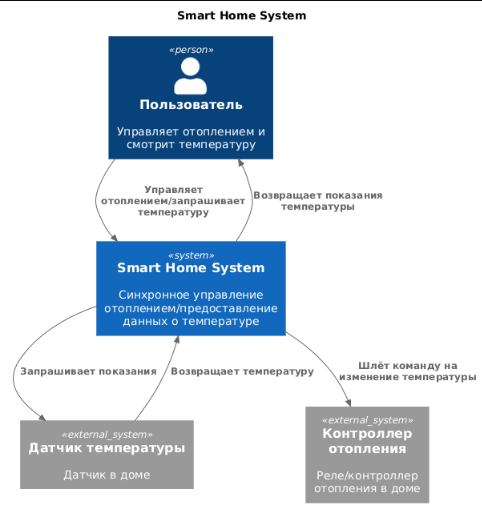
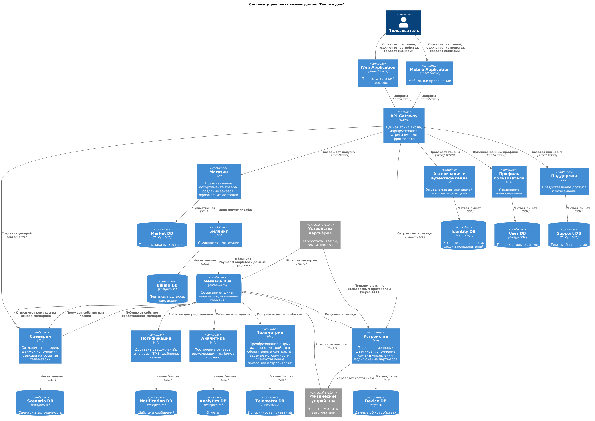
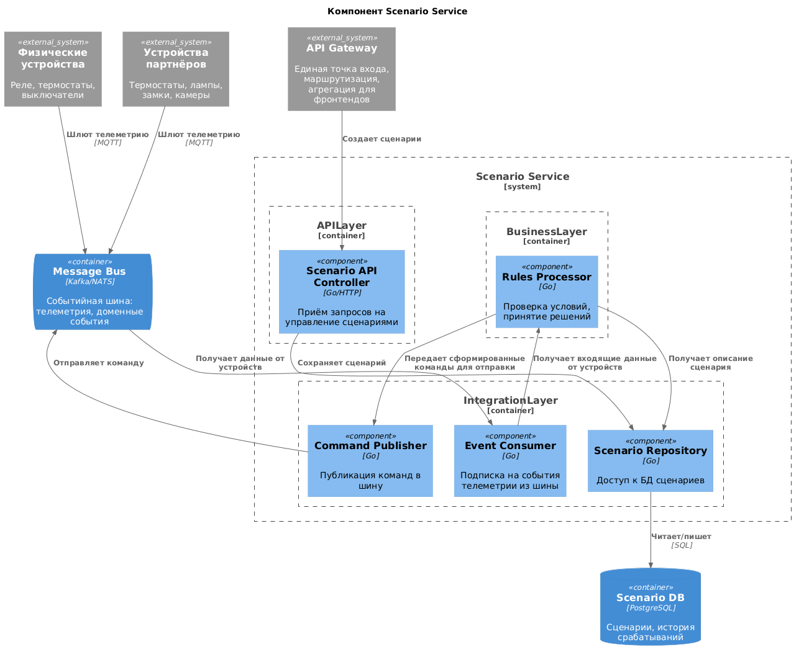
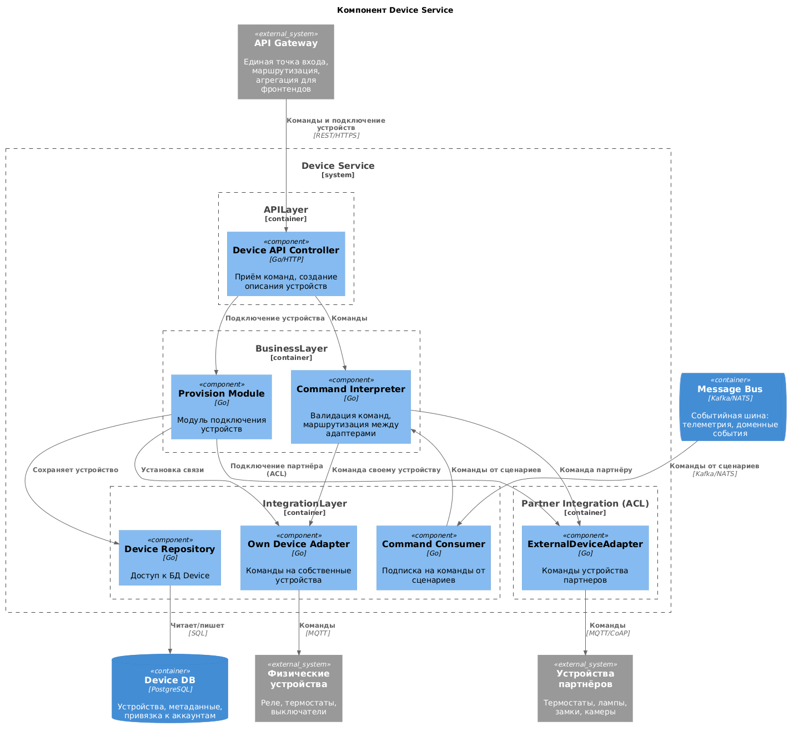
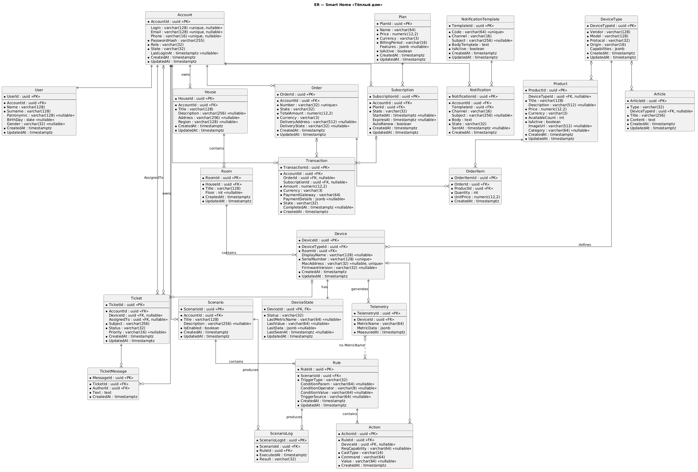

# Project_template

Это шаблон для решения проектной работы. Структура этого файла повторяет структуру заданий. Заполняйте его по мере работы над решением.

# Задание 1. Анализ и планирование

<aside>

Чтобы составить документ с описанием текущей архитектуры приложения, можно часть информации взять из описания компании и условия задания. Это нормально.

</aside

### 1. Описание функциональности монолитного приложения

**Управление отоплением:**

- Пользователи могут удалённо включать/выключать отопление в своих домах.
- Система поддерживает управление реле для выполенения команды пользователя об измении температуры отопления.

**Мониторинг температуры:**

- Пользователи могут просматривать текущую температуру
- Система поддерживает датчики температуры для получения показателей.

### 2. Анализ архитектуры монолитного приложения

Язык программирования: Go
База данных: PostgreSQL
Архитектура: Монолитная, все компоненты системы (обработка запросов, бизнес-логика, работа с данными) находятся в рамках одного приложения.
Взаимодействие: Синхронное, запросы обрабатываются последовательно.
Масштабируемость: Ограничена, так как монолит сложно масштабировать по частям.
Развертывание: Требует остановки всего приложения.

### 3. Определение доменов и границы контекстов

Управление устройствами — приём команд от пользователя и отправка их контроллеру отопления (синхронно, сервер -> устройство).
Мониторинг температуры — опрос датчиков и предоставление показаний пользователю.
Пользователи — веб-клиенты и привязка домов к пользователям.

### **4. Проблемы монолитного решения**

- Высокий риск ошибок: Добавление нового типа устройства, может повлечь за собой ошибку в случайной части системы
- Длительный цикл разработки: Добавление нового типа устройства или изменения бизнес-логики текущего, влечет за собой тестирование системы целиком
- Масштабируемость: горизонтальная масштабируемость - нельзя выделить больше ресурсов на конкретный функуционал системы. Только увеличить ресурсы целиком.
вертикальная масштабируемость — упирается в потолок мощности железа сервера.
- Развёртывание целиком: Любое изменение требует остановки и передеплоя всей системы, нет возможности релизить по частям.

### 5. Визуализация контекста системы — диаграмма С4
C4 As-Is диаграмма контекстов


Исходник: [Context_C4_As-Is.puml](./diagrams/context/Context_C4_As-Is.puml)

# Задание 2. Проектирование микросервисной архитектуры

В этом задании вам нужно предоставить только диаграммы в модели C4. Мы не просим вас отдельно описывать получившиеся микросервисы и то, как вы определили взаимодействия между компонентами To-Be системы. Если вы правильно подготовите диаграммы C4, они и так это покажут.

**Диаграмма контейнеров (Containers)**



Исходник: [C4_Containers.puml](./diagrams/containers/C4_Containers.puml)

**Диаграмма компонентов (Components)**



Исходник: [C4_Component_Scenario.puml](./diagrams/components/C4_Component_Scenario.puml)



Исходник: [C4_Component_Device.puml](./diagrams/components/C4_Component_Device.puml)

**Диаграмма кода (Code)**

Добавьте одну диаграмму или несколько.

# Задание 3. Разработка ER-диаграммы



Исходник: [er_diagrams.puml](./diagrams/er_diagrams/er_diagrams.puml)

# Задание 4. Создание и документирование API

### 1. Тип API

Тип API
В системе выбран смешанный подход в выборе API

RestAPI
Выбран для участков, где важен синхронный и немедленный ответ

1. Пользователь <-> система
	Пользователь совершает действие и ждёт подтверждения (создал сценарий → видит, что создан; запросил данные → получил их сейчас).
2. Некоторые межсервисные взаимодействия близкие к пользователю, где результат нужен немедленно.
	Например Market -> Billing при оплате. Пользователь ждет результат платежа сразу

AsyncAPI
Межсервисное взаимодействие построено на брокере сообщений
1. Не обязательно ждать выполнения
	Критично для взаимодействия, например, сценариев и устройств. Если устройство не в сети, то сообщение в брокере, может подождать появления устройства и тогда исполниться
2. Большой поток данных
	Телеметрия генерирует большой поток гетерогенных данных. При этом источник(датчик) не должен ждать обработки
3. Межсервисное взаимодействие
	При общении через RestAPI любое падение сети, приводит к тому что мы теряем часть данных, если нет дополнительных механизмов(fallBack, retry) обработки таких ситуаций. Брокер дает гарантию доставки(offset commit) и буферизацию
4. Масштабируемость
	Отдельные топики позволяют независимо масштабировать обработчиков
5. Слабая связанность
	Публикация может происходить без знания получателя. В Rest это требует от отправителя знания URL каждого получателя

### 2. Документация API

[Пример openapi](scenario-service.openapi.json)
[Пример asyncapi](device-action-events.asyncapi.yaml)

# Задание 5. Работа с docker и docker-compose

Перейдите в apps.

Там находится приложение-монолит для работы с датчиками температуры. В README.md описано как запустить решение.

Вам нужно:

1) сделать простое приложение temperature-api на любом удобном для вас языке программирования, которое при запросе /temperature?location= будет отдавать рандомное значение температуры.

Locations - название комнаты, sensorId - идентификатор названия комнаты

```
	// If no location is provided, use a default based on sensor ID
	if location == "" {
		switch sensorID {
		case "1":
			location = "Living Room"
		case "2":
			location = "Bedroom"
		case "3":
			location = "Kitchen"
		default:
			location = "Unknown"
		}
	}

	// If no sensor ID is provided, generate one based on location
	if sensorID == "" {
		switch location {
		case "Living Room":
			sensorID = "1"
		case "Bedroom":
			sensorID = "2"
		case "Kitchen":
			sensorID = "3"
		default:
			sensorID = "0"
		}
	}
```

2) Приложение следует упаковать в Docker и добавить в docker-compose. Порт по умолчанию должен быть 8081

3) Кроме того для smart_home приложения требуется база данных - добавьте в docker-compose файл настройки для запуска postgres с указанием скрипта инициализации ./smart_home/init.sql

Для проверки можно использовать Postman коллекцию smarthome-api.postman_collection.json и вызвать:

- Create Sensor
- Get All Sensors

Должно при каждом вызове отображаться разное значение температуры

Ревьюер будет проверять точно так же.


